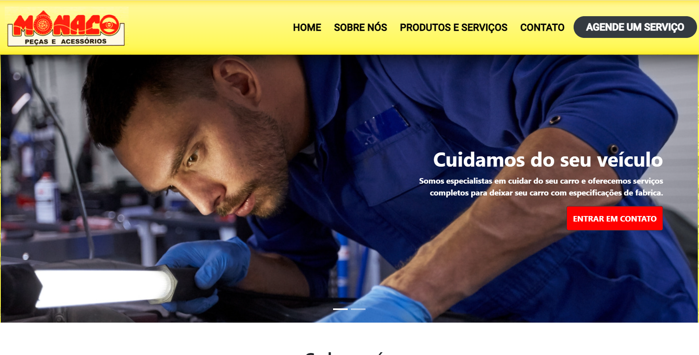
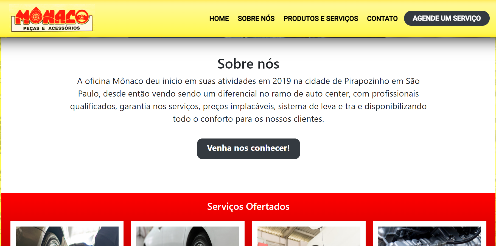
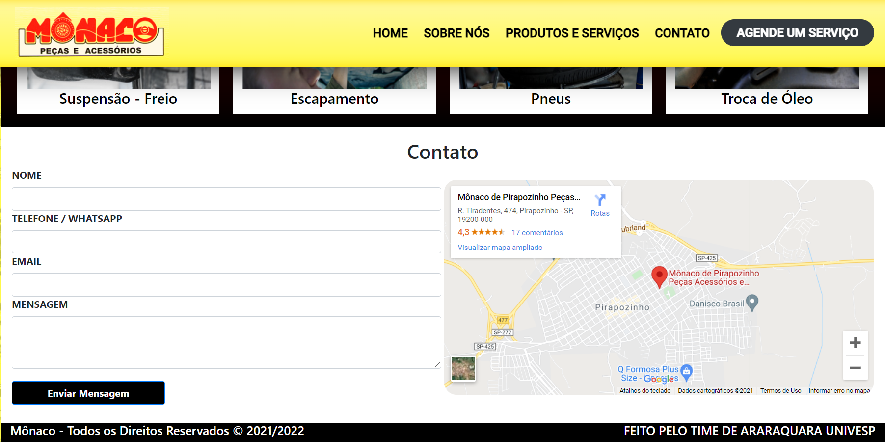

# Mônaco Oficina
## Site criado para uma oficina mecânica em Pirapozinho. Sendo um projeto para UNIVESP, onde o objetivo era a criação de uma aplicação web.
<h1 align="center">
  
</h1>

 <a href="#sobre-o-projeto">Sobre</a> •
 <a href="#funcionalidades">Funcionalidades</a> •
 <a href="#layout">Layout</a> • 
 <a href="#tecnologias">Tecnologias</a> • 

<h4 align="center"> 
	 Mônaco Oficina 🔧 Finalizado
</h4>

## Sobre o projeto

🔧 Mônaco Oficina foi um projeto desenvolvido durante a disciplina de projeto integrador, onde fomos dividido em grupos de 6 pessoas e cada um tinha uma responsabilidade, sendo atribuido
a mim, a responsabilidade de todo o desenvolvimento do front-end do site.

Nesse projeto tive a oportunidade de aplicar todos os conhecimentos adquiridos até o momento como validação de formulários, grid, flexbox, mobile first, framework Bootstrap...

## ⚙Funcionalidades

-Esse projeto foi criado utilizando como base outros sites que atuam no mesmo seguento que seria oficina mecânica:

  Página Index:
  Nesta página está localizada as informações principais ao site dividio em 4 seções sendo elas o cabeçalho fixado no topo, 
  uma seção de slide, uma seção com o campo sobre onde contém informações sobre a oficina, uma seção de servços ofertados onde
  nela está localizado diversos links para detalhar a necessidade do serviço, e no final antes do rodapé esta localizado o campo de contato
  que apresenta um formulário com o mapa indicando a localização da oficina.
  
  <h3>Página visualidada de um desktop:</h3>
  
  
  
  
  ---
  
  Página Formulário:
  Nesta página está localizada o formulário necessário para a realização de um agendamento de um serviço da oficina.
  <h3>Página visualidada de um desktop:</h3>
    
  ---   

## 🎨Layout

O layout foi criado por [Marcelo Laurentino](https://www.linkedin.com/in/marcelo-laurentino-8a54ba114/).

### 🛠Tecnologias

As seguintes ferramentas foram usadas na construção do projeto:

- [HTML](https://www.w3schools.com/html/default.asp)
- [CSS](https://www.w3schools.com/css/)
- [Bootstrap](https://getbootstrap.com/)
- [VisualStudio](https://visualstudio.microsoft.com/pt-br/)
